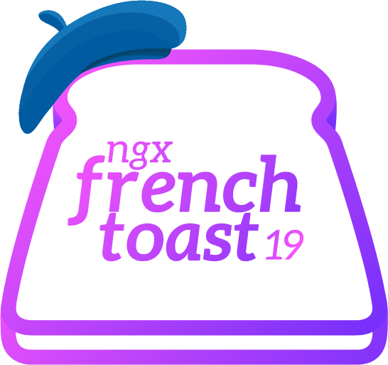

<p align="center">
  
</p>

# ngx-french-toast
## Features

- Fully built in Angular 14, without any external dependencies. Oui, très indépendant!
- Customizable toast appearance, including duration, colors, and positioning. Like a beret, you can style it to perfection!
- Unique feature: Dynamically embed components within the toast for maximum flexibility and créativité. C'est magnifique!

## Installation

To install ngx-french-toast, simply follow these étapes:

1. Run the following command to install the package via npm:

```
npm install ngx-french-toast
```

2. Import the `FrenchToastModule` in your Angular module:

```typescript
import { FrenchToastModule } from 'ngx-french-toast';
import { ToastPosition } from 'ngx-french-toast';

// optional configuration object:
const config: ToastConfig = {
  colors: {
    danger: '#a20000',
    info: '#2d96f8',
    success: '#2df877',
    warning: '#f8bb2d'
  },
  defaultDuration: 100000,
  position: ToastPosition.TOP_RIGHT // As elegant as the Eiffel Tower!
};

@NgModule({
  imports: [
    // ...
    FrenchToastModule.forRoot(config)
  ],
  // ...
})
export class AppModule { }
```

3. Add the `FrenchToastComponent` selector in your `app.component.html` (or wherever you want to):

```html
<french-toast></french-toast>
```

4. That's it! You're ready to start using ngx-french-toast in your Angular application.

## Usage

Here's a simple example demonstrating how to use ngx-french-toast:

```typescript
import { Component } from '@angular/core';
import { ToastService } from 'ngx-french-toast';

@Component({
  selector: 'app-example',
  template: `
    <button (click)="showToast()">Show Toast</button>
  `
})
export class ExampleComponent {
  constructor(private toastService: ToastService) {}

  showToast(): void {
    this.toastService.success({
      title: 'Knock, knock!',
      content: 'Who\'s there? Eiffel. Eiffel who? Eiffel in love with you!' // Mon Dieu, l'amour!
    });
  }
}
```

## Embedding Components Dynamically

To embed components dynamically just call any method from your instance of `ToastService` and pass an object with the `component` and `title` properties. For example:

```typescript
this.toastService.success({
  component: ExampleComponent,
  title: 'Oui, mon ami!'
});
```

### Programatically closing the parent toast from the embedded component
To close the parent toast from the embedded component, users should follow these steps:

1. In the embedded component (e.g., `ExampleComponent`), define an `EventEmitter` named `destroyToast` as an `@Output()` property:

```typescript
@Output() destroyToast: EventEmitter<boolean> = new EventEmitter<boolean>(false);
```

2. Emit the `destroyToast` event with `true` as the value when the desired action occurs.


### Preventing the toast from closing when your embedded component needs a button
To prevent the toast from closing when users click on a button in your embedded component, you should grab the click event like this (I know it's not parfait, I'll try to find a better solution for this in the near future 😬):
```html
<button (click)="rate(5, $event)">Five stars!</button>;
```

And on your TS file, you should use `event.stopPropagation()`. To summarize, here's an example for the whole section:

```typescript
import { Output, EventEmitter } from '@angular/core';

@Component({
  selector: 'app-example',
  template: `
    <button (click)="rate(5, $event)">Five stars!</button>;
  `
})
export class ExampleComponent {
  @Output() destroyToast: EventEmitter<boolean> = new EventEmitter<boolean>(false);

  rate(rate: number, event: Event): void {
    event.stopPropagation();
    this.someApi.rate(rate).subscribe({
      next: () => {
        this.destroyToast.emit(true);
      }
    });
  }
}
```

The `destroyToast` event emitter allows the embedded component to communicate with the parent toast and close it. Très beau!

## Using Icons

You can customize the toast appearance by adding icons. Simply pass an `icon` property inside the config object when calling the toast service. The `icon` property accepts a string that can link directly to images or SVG sprite files. Here are a few examples:

Using an SVG from a sprite:

```typescript
this.toastService.success({ title: 'Success', icon: '../assets/svg/sprite.svg#icon-success' }); // Comme un baguette of success!
```

Using an image:

```typescript
this.toastService.success({ title: 'Success', icon: '../assets/imgs/success.png' }); // C'est magnifique!
```

Note: Make sure to provide the correct path to the image or SVG file. Parfait!

## Contributions

Contributions to ngx-french-toast are welcome! If you find a bug, have a feature request, or want to contribute code improvements, please submit an issue, or fork it, or just let me know and we'll figure it out :D

## License

ngx-french-toast is licensed under the  MIT License. Feel free to use, modify, and distribute this library in accordance with the license terms.

## Contact

If you have any questions, suggestions, or feedback, you can reach out to me via <a mailto="thiago2k9@gmail.com">thiago2k9@gmail.com</a> or find me on <a href="https://www.linkedin.com/in/thiagoguterman" target="_blank">LinkedIn</a>. Don't hesitate to say "Bonjour!" and share your thoughts. Let's connect and make the ngx-french-toast community even stronger! 💪🥐

Made with ❤️ with Angular  and lots of croissants.

Merci beaucoup for using ngx-french-toast! I hope it brings a touch of créativité to your Angular applications. Bon appétit! 🍞